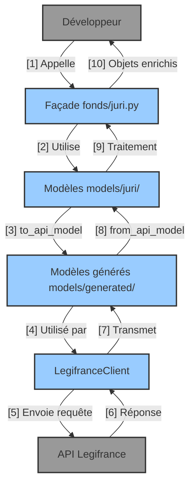

# Architecture du projet PyLegifrance

Organisation technique de PyLegifrance pour faciliter l'accès aux données juridiques françaises.

## Vue d'ensemble

Architecture en couches suivant le flux : **User > facade > models > generated models > client > api**

1. **Façades de domaine** (`fonds/`) : API de haut niveau par fonds documentaire
    - JURI (jurisprudence) - implémenté
    - LODA, CODE, JORF - à venir
2. **Modèles de domaine** (`models/`) : Structures de données métier
3. **Modèles générés** (`models/generated/`) : Modèles pour l'API
4. **Client API** (`client.py`) : Communication avec l'API Legifrance

## Pourquoi cette architecture ?

La séparation entre `fonds/juri.py` et `models/juri/` suit un principe fondamental : **séparer l'interface utilisateur de la logique technique**.

1. **`fonds/`** : **Façade de domaine**  
    - Offre une API stable et intuitive pour les développeurs et juristes
    - Masque la complexité technique de l'API Legifrance
    - Fournit des objets métier enrichis avec des méthodes utiles
    - Protège le code client des changements dans l'API sous-jacente

2. **`models/`** : **Modèles de données**
    - Définit la structure précise des données juridiques
    - Assure la validation via Pydantic (typage fort, contraintes)
    - Gère la conversion bidirectionnelle avec les modèles d'API
    - Organise le code par préoccupation technique

Cette architecture en couches permet un **flux de données clair** (User > facade > models > generated models > client > api) tout en offrant une **séparation des responsabilités** qui facilite la maintenance et l'évolution du code.

## Diagrammes C4

> Diagrammes basés sur [C4 Model](https://c4model.com/) - du contexte global aux composants détaillés.

### Niveau 1 : Diagramme de contexte système

```plantuml
@startuml Contexte Système PyLegifrance
!include https://raw.githubusercontent.com/plantuml-stdlib/C4-PlantUML/master/C4_Context.puml

LAYOUT_WITH_LEGEND()

title Diagramme de contexte système - PyLegifrance

Person(developer, "Développeur", "Développeur utilisant PyLegifrance pour accéder aux données juridiques")
Person(juriste, "Juriste", "Juriste utilisant PyLegifrance pour du scripting")

System(pylegifrance, "PyLegifrance", "Bibliothèque Python facilitant l'accès à l'API Legifrance")
System_Ext(legifrance_api, "API Legifrance", "API REST officielle pour accéder aux données juridiques françaises")

Rel(developer, pylegifrance, "Utilise", "Python API")
Rel(juriste, pylegifrance, "Utilise pour scripting", "Python API")
Rel(pylegifrance, legifrance_api, "Consomme", "HTTPS/JSON")

@enduml
```

### Niveau 2 : Diagramme des conteneurs

```plantuml
@startuml Conteneurs PyLegifrance
!include https://raw.githubusercontent.com/plantuml-stdlib/C4-PlantUML/master/C4_Container.puml

LAYOUT_WITH_LEGEND()

title Diagramme des conteneurs - PyLegifrance

Person(developer, "Développeur", "Développeur utilisant PyLegifrance")
Person(juriste, "Juriste", "Juriste utilisant PyLegifrance pour du scripting")

System_Boundary(pylegifrance, "PyLegifrance") {
    Container(domain_facades, "Façades de domaine", "Python", "Interfaces de haut niveau par fonds documentaires")
    Container(domain_models, "Modèles de domaine", "Python", "Structures de données métier")
    Container(generated_models, "Modèles générés", "Python", "Modèles générés à partir de l'API")
    Container(client_api, "Client API", "Python", "Communication avec l'API Legifrance")
}

System_Ext(legifrance_api, "API Legifrance", "API REST officielle")

' Flux principal: User > facade > models > generated models > client > api
Rel(developer, domain_facades, "1. Utilise", "Python API")
Rel(juriste, domain_facades, "1. Utilise pour scripting", "Python API")
Rel(domain_facades, domain_models, "2. Utilise")
Rel(domain_models, generated_models, "3. Convertit via to_api_model()")
Rel(generated_models, client_api, "4. Utilisé par")
Rel(client_api, legifrance_api, "5. Appelle", "HTTPS/JSON")

@enduml
```

### Niveau 3 : Diagramme des composants

```plantuml
@startuml Composants PyLegifrance
!include https://raw.githubusercontent.com/plantuml-stdlib/C4-PlantUML/master/C4_Component.puml

LAYOUT_WITH_LEGEND()

title Diagramme des composants - PyLegifrance

Person(developer, "Développeur", "Développeur utilisant PyLegifrance")
Person(juriste, "Juriste", "Juriste utilisant PyLegifrance pour du scripting")

System_Boundary(pylegifrance, "PyLegifrance") {
    Container_Boundary(facades_container, "Façades de domaine") {
        Component(juri_facade, "JuriAPI", "Python", "Façade pour le fonds JURI")
        Component(juri_decision, "JuriDecision", "Python", "Modèle enrichi pour les décisions")
    }

    Container_Boundary(models_container, "Modèles de domaine") {
        Boundary(juri_models, "Modèles JURI") {
            Component(juri_domain, "models.py", "Python", "Modèles de domaine")
            Component(juri_search, "search.py", "Python", "Modèles de recherche")
        }
        Component(common_models, "Modèles communs", "Python", "Modèles partagés")
    }

    Component(generated_models, "Modèles générés", "Python", "Modèles générés pour l'API")

    Container_Boundary(client_container, "Client API") {
        Component(client, "LegifranceClient", "Python", "Appels API")
        Component(auth, "Authentification", "Python", "Gestion des jetons")
    }
}

System_Ext(legifrance_api, "API Legifrance", "API REST officielle")

' Flux principal: User > facade > models > generated models > client > api
Rel_D(developer, juri_facade, "1. Utilise", "Python API")
Rel_D(juriste, juri_facade, "1. Utilise", "Python API")
Rel_D(juri_facade, juri_models, "2. Utilise", "")
Rel_U(juri_models, generated_models, "3. Convertit via to_api_model()", "")
Rel_D(generated_models, client, "4. Utilisé par", "")
Rel_R(client, legifrance_api, "5. Appelle", "HTTPS/JSON")

' Relations secondaires
Rel(client, auth, "Utilise", "")
Rel_D(juri_facade, juri_decision, "Crée et retourne", "")
Rel(juri_models, common_models, "Utilise", "")

@enduml
```

## Flux de données



## Avantages clés

- **Stabilité** : Interface publique indépendante des changements d'API
- **Modèles métier** : Fonctionnalités spécifiques au domaine juridique
- **Validation robuste** : Typage et validation via Pydantic
- **Structure intuitive** : Organisation par fonds documentaires juridiques
